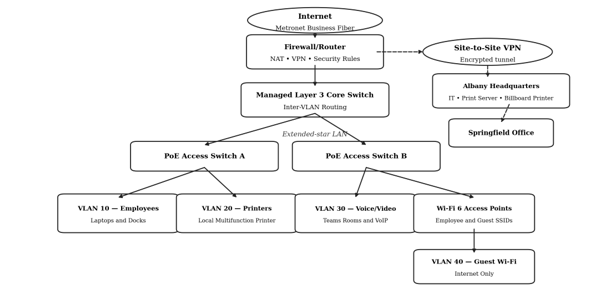

# Network Design and Troubleshooting Portfolio

A foundational networking portfolio demonstrating network design, VLAN segmentation, IP addressing, VPN connectivity, network security, and troubleshooting.

## About the Project

This project presents a network design for a 50-employee branch office that needs secure and reliable connectivity for daily internet access, cloud collaboration, video meetings, remote employees, and communication with other company locations.

The proposed solution uses a 1-Gbps symmetrical fiber connection, Ethernet, Wi-Fi 6, managed switches, VLANs, a next-generation firewall, and encrypted VPN connections. The design also supports centralized management and future growth.

## Skills Demonstrated

- Network design and planning
- Extended-star topology
- VLAN segmentation
- IP addressing and subnetting
- DHCP and static addressing
- Ethernet and Wi-Fi networking
- Firewall and network security
- Site-to-site VPN connectivity
- Quality of Service (QoS)
- DNS and DHCP troubleshooting
- Network monitoring and logging
- Structured troubleshooting

## Network Design

An extended-star topology was selected for the branch office. The firewall/router connects to a managed Layer 3 core switch, which then connects to Power over Ethernet access switches supporting employee devices, printers, wireless access points, and voice/video equipment.

This design allows the network to be expanded and managed more easily while limiting the impact of individual device or cable failures. VLANs are used to separate employee, printer, voice/video, and guest wireless traffic for improved performance and security.

### Network Diagram

## IP Addressing and VLAN Plan

The network uses separate private subnets for different device groups to improve organization, security, and performance.

- VLAN 10 - Employees: `10.30.10.0/26`
- VLAN 20 - Printers: `10.30.20.0/27`
- VLAN 30 - Voice/Video: `10.30.30.0/27`
- VLAN 40 - Guest Wi-Fi: `10.30.40.0/26`

DHCP should assign addresses to employee and guest devices, while switches, access points, printers, and other infrastructure devices should use reserved or static addresses.

## Network Security and Connectivity

A next-generation firewall provides security controls for the branch network and supports encrypted site-to-site VPN connectivity with other company locations.

VLAN segmentation helps limit unauthorized access between employee, printer, voice/video, and guest networks. Secure VPN connections protect traffic traveling between offices, while Quality of Service (QoS) gives priority to voice and video traffic during periods of high network usage.

## Network Troubleshooting

Troubleshooting begins by identifying which users and services are affected and determining whether the problem involves one device, one VLAN, the entire branch office, or the WAN connection.

Common issues may include:

- ISP or power outages
- DHCP failures
- Duplicate IP addresses
- DNS failures
- Incorrect VLAN or trunk configurations
- Firewall or VPN issues
- Weak wireless coverage
- Congested links
- Printing or remote-resource connectivity problems

Useful troubleshooting tools and commands include `ping`, `ipconfig`, `nslookup`, `tracert`, switch interface statistics, firewall and VPN logs, and packet captures.

Testing should move outward from the local device to the default gateway and then to remote resources. After a correction is made, the affected service should be retested and the cause and resolution documented.

## Network Monitoring and Maintenance

Ongoing monitoring helps identify performance problems and potential failures before they significantly affect users. Network devices should be monitored using centralized tools and logging so administrators can review device health, traffic patterns, errors, and security events.

Recommended practices include:

- SNMPv3 for secure device monitoring
- Centralized syslog collection
- Network traffic and flow monitoring
- Packet capture when deeper troubleshooting is required
- Regular firmware and security updates
- Network asset documentation
- Configuration backups and change documentation

 ## Key Takeaways

This project helped me strengthen my understanding of:

- Designing a scalable business network
- Organizing network traffic through VLAN segmentation
- Planning IP address ranges and subnet sizes
- Supporting secure communication between locations
- Applying network security controls
- Troubleshooting connectivity problems systematically
- Monitoring network performance and device health
- Documenting network configurations and changes

I am continuing to build my networking knowledge through hands-on practice with network configuration, troubleshooting, security, and infrastructure technologies.
